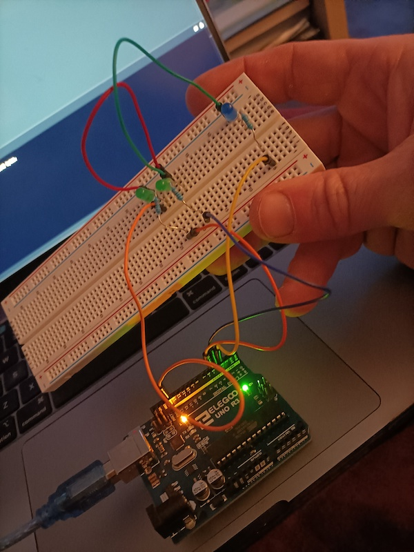

# Arduino Playground

We got "The Most Complete Starter Kit UNO R3 Project" from Amazon.

It has a lot of pieces. No idea what we're doing, but let's play.

1. [Hello World Blinky Lights](hello_world_blinky_lights/hello_world_blinky_lights.ino) - Make some lights blink so we know it's alive.
2. [Lights on Board](lights_on_board/lights_on_board.ino) - Make lights on the board go blink blink

